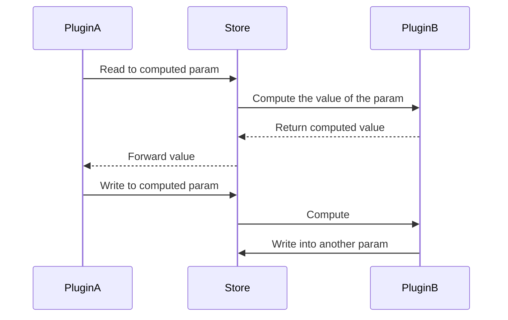

# Design of Turbo system

This audio/video editor aims:

1. Blazing fast
2. Cross platform
3. Ease to extend

## Param

All values for use in rendering are contained as a `Param`. It also has some constraints parameter for making the value consistent.

### Primitive param

These are types of the primitive param. It can be edited by user directly and referenced in some plugin code. All params have its default value, used to reset the param.

Constraints parameters of all primitive params are following:

- `Boolean`
  - radioButtonGroup
- `Int`
  - minValue
  - maxValue
  - steps
  - useSlider
- `Float`
  - minValue
  - maxValue
  - steps
  - useSlider
- `ShortText`
  - placeholderText
  - maxLength
- `LongText`
  - placeholderText
  - maxColumns
  - maxRows
- `Vec2`, `Vec3`, `Vec4`
  - minValues
  - maxValues
  - componentNames
- `Mat2x2`, `Mat2x3`, `Mat2x4`, `Mat3x2`, `Mat3x3`, `Mat3x4`, `Mat4x2`, `Mat4x3`, `Mat4x4`
- `Anchor`
- `Texture`
  - minSize
  - maxSize
- `AudioSample`
  - sampleRate
  - channels
- `FileHandle`
  - identifier
  - outputType
- `Shader`
  - identifier
- `Speaker`
  - identifier
- `RenderObjectRef`
  - type

### Computed param

A computed param is registered by the plugin with an identifier. The identifier of the plugin, the identifier of the param and its type of value are stored in it. When reading/writing value to the param, it will be a value of primitive params and the process is delegated to the handler of the plugin which belongs.



Writing to a computed params from another computed param handler will be chained. But there are the recursion limit to prevent it from infinite recursion, which is writing computed params each other.

## Rendering

### RenderObject

RenderObject expresses an unit of rendering audio/video data such as movies, images, sounds, vector graphics, filters and so on. And it defines its `Param`s, which can be used by other plugins' code.

#### Included params

All RenderObjects are forced to hold these params:

- `selected: Boolean`
- `startTime: Float`
- `endTime: Computed<Float>`
- `duration: Float`
- `position: Vec3`
- `rotation: Vec4`
- `scale: Vec3`

#### Static RenderObjects

Camera is a fallback RenderObject, which is used when no other cameras exist. RenderObjects which can be seen by this camera are rendered on exporting. This has parameters as below:

- `frameRate: Float`
- `frameSize: Size`
- `near: Float`
- `far: Float`
- `view: Computed<Matrix4x4>`

Microphone is a fallback RenderObject, which is used when no other microphones exist. RenderObjects which can be heard by this microphone are rendered on exporting. This has parameters as below:

- `sampleRate: Int`
- `audioChannels: Int`
- `volume: Float`

#### Registering params

All RenderObjects are registered by some plugin. The user can create a new RenderObject to the project. No RenderObject is provided by Turbo main system only, but there are some official plugins which provide them.

To register RenderObject, you only need to provide information of that's identifier and parameters. In other words, a RenderObject is the set of parameters. You can register your RenderObject in the register phase handler of your plugin. The identifier must not conflict in your plugin, but conflicting to another plugin occurs no problem. Here are example code:

```rs
use turbo_plugin::{ComputedParam, ComputedParamType, PrimitiveParam, register_render_object};

#[fp_export_impl(turbo_plugin)]
pub fn on_register_phase() {
    register_render_object(RenderObject {
        identifier: "box".into(),
        params: [
            ("size".into(), PrimitiveParam::Vec3(1.0, 1.0, 1.0).into()),
            ("hollow".into(), PrimitiveParam::Float(0.0).into()),
            ("thickness".into(), ComputedParam {
                identifier: "thickness".into(),
                ty: ComputedParamType::Float,
            }),
        ].into_iter().collect(),
    });
}
```

## Plugin system

Turbo main system has 4 launching phases:

1. Metadata phase
2. Register phase
3. Load phase
4. Unload phase

Load/unload phases can occur multiple times because the user can enable/disable your plugin any time. But same one of them will not occur in succession.

### Metadata handler

You MUST define your metadata handler to return the plugin's identifier, which is invoked in Metadata phase, version, dependencies and so on. The identifier must not conflict with other plugins, so you should use your vendor name and your plugin name in the identifier. There is no unavailable character. The plugin which not defined the metadata handler will be showed as an invalid plugin in the plugin manager in Turbo main system, and all of it's handler will not be invoked.

The plugin version is treated as [Semantic Versioning 2.0.0](https://semver.org/spec/v2.0.0.html). The version in your metadata is considered on the project file compatibility. And the version in dependencies in your metadata also be considered for the plugin compatibility.

If the incompatible version of the plugin is detected, Turbo will ask the user whether to enable or disable the plugin with showing the conflicted version of them.

```rs
use turbo_plugin::Metadata;

#[fp_export_impl(turbo_plugin)]
pub fn metadata() -> Metadata {
    Metadata {
        identifier: "MikuroXina.tween-editor".into(),
        version: (0, 1, 0).into(),
        dependencies: vec![
            ("MikuroXina.property-editor", (0, 1, 0).into()),
        ],
    }
}
```

### Register handler

You can define your register handler to register FileHandles, Shaders and Speakers of your plugin, which is invoked in register phase. The functions provided from `turbo_plugin` for registration can be called within Register phase only. Calling them in other phases does not take any effect. How to register using their definition object, see the docs of them.

If you registered FileHandle or Speaker, you MUST defined the handler following below sections. Otherwise, Turbo will report an error to the user and disable your plugin.

```rs
use turbo_plugin::{register_file_handle, register_shader, register_speaker};

#[fp_export_impl(turbo_plugin)]
pub fn on_register_phase() {
    register_file_handle(FileHandleDefinition {
        // ...
    });
    register_shader(ShaderDefinition {
        // ...
    });
    register_speaker(SpeakerDefinition {
        // ...
    });
}

// Define handlers for your registered items...
```

### Load/Unload handler

You can define load handler and unload handler, which invoked in the load phase and unload phase respectively. If you don't need to do any thing in the phase, you don't have to export it.

```rs
#[fp_export_impl(turbo_plugin)]
pub fn load() {
    // On the load phase...
}

#[fp_export_impl(turbo_plugin)]
pub fn unload() {
    // On the unload phase...
}
```

### FileHandle handler

When you registered a `FileHandleDefinition`, you MUST define your file handler to parse actual data from the file binary. The provided file handle, `TurboFile` implements `std::io::{BufRead, Read, Seek}`. It can be used in some reader library.

```rs
use turbo_plugin::types::{FileHandle, Param, Result, TurboFile};
use mp4::Mp4Reader;

#[fp_bindgen_support::fp_export_signature]
pub fn on_file_handle(handle: FileHandle, file: TurboFile) -> Result<Param> {
    if handle.identifier == "mp4" {
        let mp4 = Mp4Reader(file, f.len());

        for track_id in mp4.tracks().keys().copied() {
            let sample_count = mp4.sample_count(track_id).unwrap();

            for sample_id in 1..=sample_count {
                let sample = mp4.read_sample(track_id, sample_id);
            }
        }
    }
}
```

### Speaker handler

When you registered a `SpeakerDefinition`, you MUST define your speaker handler to process audio waveforms quickly. You should not allocate any memory on the process, invoke another slow function, or lock the thread for a while in your handler. Doing it may happen some bad experiences about the audio.

```rs
use turbo_plugin::types::{AudioSample, Error, Float, Result, Speaker, Store, global, local};

#[fp_bindgen_support::fp_export_signature]
pub fn on_speaker(speaker: Speaker) -> Result<AudioSample> {
    if speaker.identifier == "" {
        let fade_time = local::<Float>("fade_time")?.as_f64();
        let source = global::<AudioSample>("microphone")?;
        if fade_time <= 0.0 {
            return Ok(source);
        }
        let end_time = local::<Float>("end_time")?.as_f64();
        let current_time = global::<Float>("current_time")?.as_f64();
        let volume = (end_time - current_time).clamp(0.0, fade_time) / fade_time;
        let mut faded = source.clone();
        for sample in faded.samples_mut() {
            *sample *= volume;
        }
        Ok(faded)
    }
    Err(Error::Unsupported)
}
```

### Window handler (WIP)

If you want to show own window for your plugin, you can do it by defining a window handler, which displays your HTML page and communicate with only your plugin. Accessing the internet and/or files is restricted, but it can realize by Turbo API via your plugin code.

```rs
use turbo_plugin::types::Html;

#[fp_bindgen_support::fp_export_signature]
pub fn on_window() -> Result<Html> {
    Html::from_source(r"
<!DOCTYPE HTML>
<html>
    <head>
        <title>My Window</title>
    </head>
    <body>
        <h1>Hello, world!</h1>
        <script>
        console.log('test');
        </script>
    </body>
</html>
    ")
}
```
